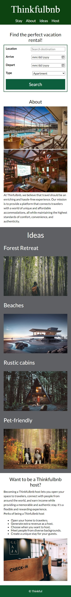

# Thinkfulbnb

### [Live Link](https://mattkulka.github.io/thinkfulbnb/)

Thinkfulbnb is a vacation rental website that allows people to rent out their homes to people who are seeking short-term accommodations in that locale. Thinkfulbnb hosts rent out different kinds of properties, including single rooms, apartments, and unique living spaces such as yachts, houseboats, yurts, tiny houses, and even renovated medieval castles.

For this assignment, I implemented Thinkfulbnb's landing page in HTML & CSS.

## Thinkfulbnb views

Here are the Desktop and Mobile views for the landing page

### Mobile view

### Desktop view

